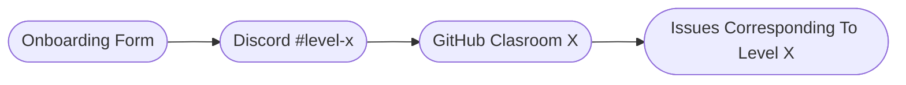

# Contributing to AgentTorch

Hey there! We're excited to have you on board and eager to help you contribute
to the AgentTorch framework. To make the process smoother and more enjoyable,
we've created a step-by-step guide to get you started.

1. First, you'll need to fill out our onboarding form, which will help us
   determine the level at which you can contribute to the project. Each level
   has its own Discord channel, `#level-x`, which you'll be invited to join soon
   after you fill the form.

   > Each level's channel will have one moderator, called the level lead, who
   > will help and unblock you as you progress. You can also connect with other
   > contributors, get help, and stay updated on the project via Discord.

2. Next, you'll need to complete the GitHub Classroom for your assigned level.
   This tutorial will teach you the skills required to tackle issues at that
   level.
3. Then, you can start taking on issues and actually contributing to the
   project. All issues on GitHub that can be taken up by external contributors
   will be labelled `level-x`, where `x` denotes the level number.

## Levels

For each level, a minimum requirement, a GitHub classroom tutorial, and a list
of issues you can tackle will be provided. If you get stuck at any point, please
don't hesitate to ask your level lead for help.

> You can become a level lead too, once you reach Level 5! You can apply for
> this position by messaging a project maintainer on Discord.

### `level-0`

This is where you'll start your journey with AgentTorch. The GitHub Classroom
tutorial for this level will teach you how to set up and run a model using the
framework, as well as how to set up your environment for development.

Contributions at this level can be made by pointing out inconsistencies, errors
or other such problems in existing tutorials and documentation. This can be done
by creating issues in the repository using the correct issue templates.

### `level-1`

Once you've completed Level Zero, you'll be ready to move on to Level One. The
GitHub Classroom tutorial for this level will teach you how to create and deploy
changes to the documentation.

Contributions at this level can be made by fixing errors pointed out by other
users in the documentation, and by tackling any issues pertaining to writing and
deploying documentation.

### `level-2`

This level is for those contributors who have completed Level Two and are ready
to take on more challenging tasks. The GitHub Classroom tutorial will teach you
how to fix minor bugs from the GitHub issue tracker, and refactor small parts of
the codebase.

At this level, you can contribute by taking up minor bug reports from the GitHub
issue tracker, interact with the issue reporter, and file a pull request to fix
the bug. You can also help improve readability of the code and implement best
practices throughout the codebase.

### `level-3`

Once you've completed a sufficient number of refactors or bug fixes to attain
familiarity with the codebase, you may move on to Level Three or Four.

The GitHub Classroom tutorial for Level Three will teach you how to create
populations using the AgentTorch `DataLoader` API. You can contribute at this
level by creating and documenting these populations and other such synthetic
data.

### `level-4`

The GitHub Classroom tutorial for this level will teach you how to write models
that make full use of the features AgentTorch provides, as well as how to write
good unit tests.

Contributions at this level can be made by refactoring models and testing parts
of the codebase.

### `level-5`

By this level, you should be very familiar with the AgentTorch Python API. The
GitHub Classroom will take your knowledge further by delving deep into several
aspects of the framework, namely, writing models, using LLMs as agents, the
`Behavior` API, and various differentiable utilities.

At this level, you'll have the chance to pick up issues in any of these areas,
or submit a proposal, get feedback from the maintainers, and implement it after
incorporating the given feedback.

### `level-6`

At this level, as a seasoned contributor, you'll be mentored directly by the
project's maintainers. You will work on adding new features, changing and fixing
existing functionality, and taking on more complex tasks in general.

## Code of Conduct

By contributing to this project, you agree to abide by its code of conduct,
which can be found [here](docs/code-of-conduct.md). Please bring any violations
of the code of conduct to the notice of the project's maintainers.

#### Thank you for contributing!
