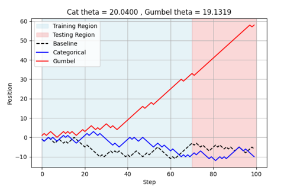
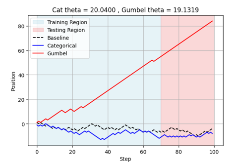

# Differentiable Discrete Sampling using AgentTorch     
## Introduction
Traditional neural networks excel at continuous computations but struggle with discrete sampling operations because the sampling process is inherently non-differentiable. This tutorial demonstrates how to use AgentTorch to implement differentiable discrete sampling, enabling gradient-based optimization through stochastic discrete operations.

**Key Concepts:**

- **Discrete Sampling**: Operations that produce discrete outcomes (e.g., Bernoulli trials, categorical choices)
- **Differentiable Relaxations**: Techniques to estimate gradients through non-differentiable operations
- **Straight-Through Estimator**: A simple gradient approximation that copies gradients from output to input
- **Stochastic Triples Method**: More sophisticated gradient estimation using probability-aware weightings

## Experiment 1: Markovian Random Walk 
Let's implement a 1D markovian random walk X0, X1, ...., Xn using the `agent_torch.core.distribution.Categorical` sampling method. The agent can move left or right with probabilites:

- Xn+1 = Xn + 1 with probability e^(-Xn/p)
- Xn+1 = Xn - 1 with probability 1 - e^(-Xn/p)

First, lets import the important modules:

```python
import torch
import math
from agent_torch.core.distributions import Categorical
```
We are interested in studying the asymptotic behavior of the variance of
our automatically derived gradient estimator, and so set p = n so that the transition function varies appreciably over the range of the walk for all n.

Let's define the main function:

```python
def random_walk_categorical(n, p, device):
    x = 0.0  # initial state
    path = [0.0]
    for _ in range(n):
        # Compute the probability of moving up.
        q = math.exp(-x / p)
        prob = torch.tensor([q, 1.0 - q], dtype=torch.float32, device=device).unsqueeze(0)  
        # Sample an action using the custom Categorical function.
        sample = Categorical.apply(prob)  
        move = 1 if sample.item() == 0 else -1
        # if at x==0, a downward move is overridden, since probability for going up is 1.
        if x == 0 and move == -1:
            move = 1
        x += move
        path.append(x)
    return path
```
This random walk can be generated by:

```python
n = 20  # A 20 step simulation
p = n
device = torch.device("cuda" if torch.cuda.is_available() else "cpu")
random_path = random_walk_categorical(n,p,device)

# This random walk looks like [0,1,2,1,...]
```
Having seen how a random walk is implemented using AgentTorch, let's benchmark this against the Gumbel softmax method. The Gumbel softmax method is a differentiable approximation to the categorical distribution, allowing for gradient-based optimization. Let's discuss the experiment setup.

#### Experiment Setup
This experiment focuses on the optimization of a parameter θ (theta) embedded within an exponential probability distribution function exp(-(x + θ)/p), which governs the stochastic transition dynamics of our model. The primary objective is to calibrate θ such that the model's behavior closely approximates a baseline implementation, as measured by mean squared error (MSE).

The methodology involves generating a substantial dataset comprising 1,000 trajectories, each consisting of 100 discrete time steps. This dataset is partitioned following standard machine learning protocols, with 70% allocated for parameter estimation (training) and 30% reserved for out-of-sample validation (testing).

By systematically adjusting θ, we aim to modulate the underlying probability distribution, thereby altering the likelihood of specific state transitions. This parameter optimization process seeks to minimize the discrepancy between the simulated trajectories and those produced by the baseline model. The efficacy of each candidate value for θ is quantitatively assessed via the MSE metric, which provides a rigorous measure of the deviation between the predicted and reference trajectories.

This approach enables the fine-tuning of stochastic models to replicate observed phenomena with enhanced precision, with potential applications in various domains including statistical physics, financial modeling, and computational biology.

#### Results
The empirical findings demonstrate that the `agent_torch.core.distribution.Categorical` approach consistently exhibits superior performance metrics compared to the Gumbel-based method. Specifically, the `agent_torch.core.distribution.Categorical` method maintains consistently lower Wasserstein distance values across all experimental configurations, indicating better alignment between simulated and baseline distributions. Furthermore, the `agent_torch.core.distribution.Categorical` approach effectively preserves the variance ratio at approximately unity, which substantiates that the generated trajectories maintain distributional characteristics highly comparable to those of the baseline.

Although the parameter convergence behavior varies across different initialization points, particularly for initial values of 10.0 and 0.0, the distributional properties of the Categorical method's outputs remain demonstrably superior to those produced by the Gumbel approach. This superiority is quantitatively verified through both lower Wasserstein distance measurements and reduced mean squared error metrics, which collectively indicate that the `agent_torch.core.distribution.Categorical` method generates distributions with greater fidelity to the baseline distribution regardless of initialization conditions. These results suggest that the `agent_torch.core.distribution.Categorical` approach provides a more robust framework for distribution matching in this experimental context, maintaining consistent performance advantages across varied experimental configurations.

These results will further become clear when we plot these random walks. It can clearly be infered that the Gumbel method starts diverging from the baseline and performs poorly on the test dataset.




## Experiment 2: Neural Relational Inference

## Conclusion
This tutorial demonstrated how to implement and use differentiable discrete sampling operations using AgentTorch.