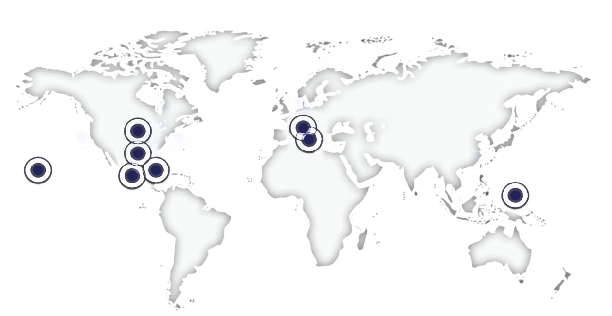

<h1 align="center">
  <a href="https://lpm.media.mit.edu/" target="_blank">
    Large Population Models
  </a>
</h1>

<p align="center">
  <strong>making complexity simple</strong><br>
  differentiable learning over millions of autonomous agents
</p>

<p align="center">
  <a href="https://github.com/AgentTorch/AgentTorch/blob/master/license.md" target="_blank">
    
  </a>

  <a href="https://agenttorch.github.io/AgentTorch/" target="_blank">
    
  </a>
  <a href="https://twitter.com/intent/follow?screen_name=ayushchopra96" target="_blank">
    
  </a>
  <a href="https://join.slack.com/t/largepopulationmodels/shared_invite/zt-2jalzf9ki-n9nXG5FryVSMaPmEL7Wm2w" target="_blank">
     
  </a>
</p>

Large Population Models (LPMs) help simulate million-size populations by
designing realistic environments and capturing expressive indvidual behavior.
Our goal is to "re-invent the census": built entirely in simulation, captured
passively and used to protect country-scale populations. Our research is early
but actively making an impact - winning awards at AI conferences and being
deployed across the world. Learn more about LPMs
[here](lpm.media.mit.edu/research.pdf).

AgentTorch LPMs have four design principles:

- **Scalability**: AgentTorch models can simulate country-size populations in
  seconds on commodity hardware.
- **Differentiability**: AgentTorch models can differentiate through simulations
  with stochastic dynamics and conditional interventions, enabling
  gradient-based learning.
- **Composition**: AgentTorch models can compose with deep neural networks (eg:
  LLMs), mechanistic simulators (eg: mitsuba) or other LPMs. This helps describe
  agent behavior using LLMs, calibrate simulation parameters and specify
  expressive interaction rules.
- **Generalization**: AgentTorch helps simulate diverse ecosystems - humans in
  geospatial worlds, cells in anatomical worlds, autonomous avatars in digital
  worlds.

AgentTorch is building the future of decision engines - inside the body, around
us and beyond!

https://github.com/AgentTorch/AgentTorch/assets/13482350/4c3f9fa9-8bce-4ddb-907c-3ee4d62e7148

## Installation

> AgentTorch is meant to be used in a Python 3.9 environment. If you have not
> installed Python 3.9, please do so first from
> [python.org/downloads](https://www.python.org/downloads/).

Install the framework using `pip`, like so:

```sh
> pip install git+https://github.com/agenttorch/agenttorch
```

> Some models require extra dependencies that have to be installed separately.
> For more information regarding this, as well as the hardware the project has
> been run on, please see [`docs/install.md`](docs/install.md).

## Getting Started

The following section depicts the usage of existing models and population data
to run simulations on your machine. It also acts as a showcase of the Agent
Torch API.

A Jupyter Notebook containing the below examples can be found
[here](docs/tutorials/using-models/walkthrough.ipynb).

### Executing a Simulation

```py
# re-use existing models and population data easily
from agent_torch.models import disease
from agent_torch.populations import new_zealand

# use the executor to plug-n-play
from agent_torch.execute import Executor

simulation = Executor(disease, new_zealand)
simulation.execute()
```

### Using Gradient-Based Learning

```py
# agent_"torch" works seamlessly with the pytorch API
from torch.optim import SGD

# create the simulation
# ...

# create an optimizer for the learnable parameters
# in the simulation
optimizer = SGD(simulation.parameters())

# learn from each "episode" and run the next one
# with optimized parameters
for i in range(episodes):
	optimizer.zero_grad()

	simulation.execute()
	optimizer.step()
	simulation.reset()
```

### Talking to the Simulation

```py
from agent_torch.llm.qa import SimulationAnalysisAgent, load_state_trace

# create the simulation
# ...

state_trace = load_state_trace(simulation)
analyzer = SimulationAnalysisAgent(simulation, state_trace)

# ask questions regarding the simulation
analyzer.query("How are stimulus payments affecting disease?")
analyzer.query("Which age group has the lowest median income, and how much is it?")
```

## Guides and Tutorials

### Understanding the Framework

A detailed explanation of the architecture of the Agent Torch framework can be
found [here](docs/architecture.md).

### Creating a Model

A tutorial on how to create a simple predator-prey model can be found in the
[`tutorials/`](docs/tutorials/) folder.

### Contributing to Agent Torch

Thank you for your interest in contributing! You can contribute by reporting and
fixing bugs in the framework or models, working on new features for the
framework, creating new models, or by writing documentation for the project.

Take a look at the [contributing guide](docs/contributing.md) for instructions
on how to setup your environment, make changes to the codebase, and contribute
them back to the project.

## Impact

> **AgentTorch models are being deployed across the globe.**


